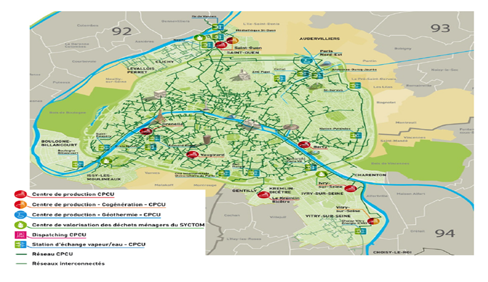
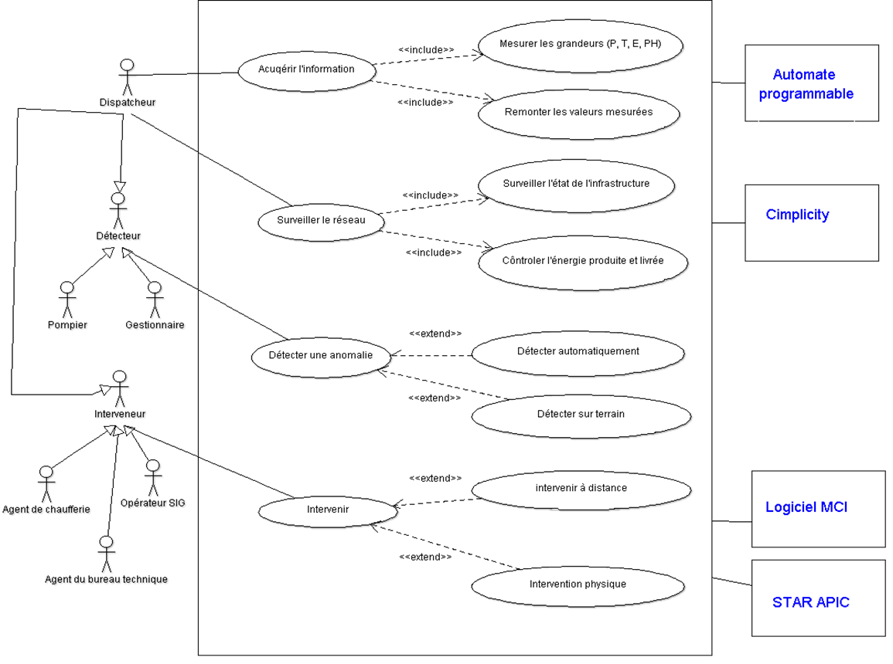
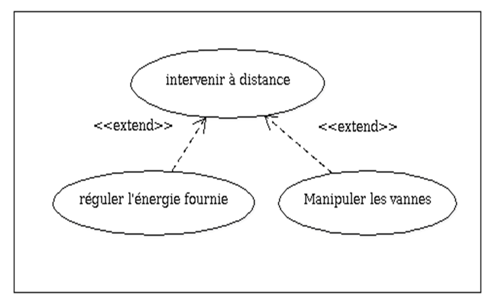
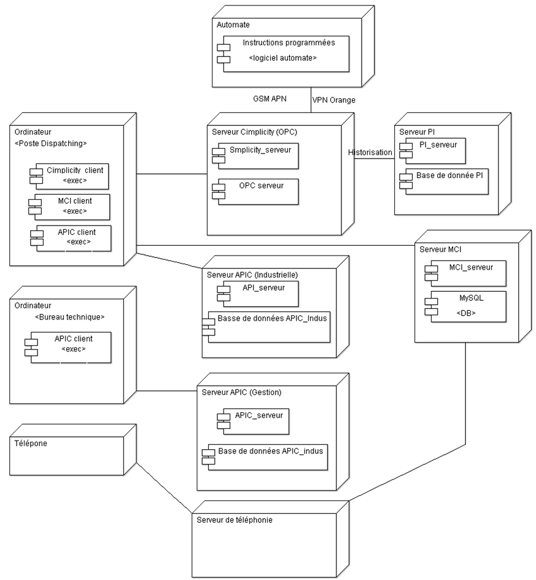

% Rapport de projet : Architecture et structuration
% Hanane ELJABIRI & Hatim LAMGHARI
% Master TSI, ENSG 

 \newpage

# REMERCIEMENTS

A la lumière de ces lignes, qu’il nous soit permis d’exprimer notre profonde gratitude à l'entreprise CPCU de nous avoir accueilli.
En particulier, nous adressons nos remerciements les plus sincères à :

- **M. Stéphane BOIS,** responsable service Expertise et Innovation ;
- **M. Sebastiano VISCUSO,** responsable du service Dispatching ;
- **M. Jabrane LAMGHARI,** Chef de projet informatique ;
- **M. Jean Pierre CHAMPAULT,** Responsable du service SIG 

pour le temps qu'ils nous ont consacré malgré leurs agendas chargés. 

 \newpage
 

# Introduction

Le présent rapport fait la synthèse des travaux menés dans le cadre du projet d’architecture et de structuration prévu dans le cursus du master Technologies et Systèmes de l’Information (TSI)  de l’École Nationale des Sciences Géographiques.

En effet, le projet consiste à modéliser le système d’information d’une entreprise moyennant le langage de modélisation unifié UML.

Par ailleurs, en étant des étudiants du master de spécialisation en TSI, et compte tenu de  notre background en modélisation,  architecture et gestion de projet, nous sommes amenés à mettre en épreuves nos connaissances en répondant aux objectifs suivants :

- Organiser une visite d’immersion en une entreprise gestionnaire de réseau ;
- Interviewer différents profils et comprendre le métier de l’organisme d’accueil ;
- Définir la problématique à traiter ;
- Modéliser le système actuel ;
- Mettre en exergue les faiblesses du système de fonctionnement existant ;
- Proposer des aspects d’amélioration.

Afin de répondre aux objectifs précités, nous avons contacté l’entreprise CPCU afin de nous permettre de découvrir de près le métier de la distribution de la chaleur en Ile-de-France et d’étudier l’architecture de son système d’information.

À travers ce rapport, nous résumons les péripéties du projet en  commençant  par détailler le contexte du projet,  nous enchaînerons par la  présentation du travail de modélisation effectué et nous  finirons par une analyse des points de faiblesse constatés et des suggestions d’amélioration du système actuel.

 \newpage
 
# CONTEXTE DU PROJET

##Organisme d’accueil

Opérateur de réseau de chaleur urbain en métropole parisienne, CPCU produit, transporte et distribue de la chaleur pour répondre aux besoins de chauffage et d’eau chaude sanitaire de l’habitat et du tertiaire public ou privé dans Paris et en proche périphérie.
Entreprise publique locale, filiale de la Ville de Paris et du Groupe GdF-Suez, CPCU est un acteur privilégié du Plan Climat de la Ville de Paris et de l’aménagement urbain durable grâce à son bouquet énergétique favorisant les énergies locales, renouvelables et de récupération.

###CPCU en chiffre :

- 1er réseau de chaleur en France,
- 1/3 du chauffage collectif à Paris,
- 8 sites de production dont 2 de cogénérations,
- 3 sites SYCTOM (valorisation énergétique des déchets ménagers),
- 475 km de réseau,
- 17 communes desservies,
- 19 boucles d’eau chaude,
- 500 000 équivalents logements pour Paris dont presque 60 000 dans le 15ème arrondissement.

##Périmètre du projet

Dans le cadre de ce projet, nous avons choisi de se limiter à l’aspect gestion des risques relatifs à un réseau de distribution de la vapeur.

Nous avons examiné les différents types d’anomalie associées à un réseau ce qui nous a permis de faire la distinction suivante :

**1. Défaillances  qui viennent de l’équipement :**

A ce niveau nous avons identifié les cas suivants :

- Dégradation du matériel : Usure, influence des propriétés chimiques de la vapeur…
- Endommagement de l’infrastructure réseau par un tiers

**2. Anomalies de fonctionnement :**

C’est en général des perturbations dans un des processus industriels (exemple : évacuation du condensat au niveau des canalisations) ou bien des fluctuations au niveau de l’énergie fournie par les chaufferies et distribué dans le réseau.
Selon le type de l’anomalie et sa sévérité, le CPCU a mis en place un système de détection et d’intervention automatique, semi automatisé  ou direct.

Ainsi, Nous avons choisi de se focaliser sur ce volet, et plus particulièrement, notre travail de modélisation va répondre aux problématiques suivantes :

- Comment peut-on détecter une anomalie dans le système qui apparait dans le réseau?
- Comment fait-on une intervention pour gérer une anomalie?

Ceci dit, nous allons modéliser les systèmes (système informatique et organisation associée) qui interviennent dans les phases de détection et d’intervention pour la gestion de quelques anomalies.

Nous précisons que notre étude de risque n’est pas exhaustive et que nous allons se contenter  à quelques exemples significatifs de chaque type d’anomalie distingué un peu plus haut.

 \newpage

#Modélisation du fonctionnement CPCU : Système & organisation

##Description du fonctionnement

Nous allons nous focaliser dans cette partie sur l’explication du duplex qui caractérise le système informatique de CPCU.

En effet, nous distinguons deux sous-systèmes dans le système général de CPCU : Le système relatif au métier (volet industriel) et le système de gestion.

Nous nous intéressons à ces deux systèmes puisque le sujet de notre étude, à savoir la gestion des anomalies, est traité dans les deux systèmes.

Afin de simplifier, nous résumons les deux systèmes dans le schéma suivant.

Ceci dit, par exemple,  les types d’anomalies qui apparaissent au niveau des locales sous-stations sont détectés par le système informatique de gestion. A ce niveau, nous nous limiterons aux anomalies types : Ne purge pas, Puisard noyé et Vapeur acide .

- L’anomalie « Ne purge pas »

Ce type d’anomalie est détecté grâce à des capteurs qui surveillent l’état de fonctionnement des purgeurs au niveau de la sous station.

Dès que le capteur  détecte que le condensat (l’eau produite par les déperditions thermiques de la tuyauterie) n’est pas évacué correctement, l’automate associé envoie des alertes de types « Ne purge pas » au service de Dispatching (Service industriel).

L’état de traitement est enregistré dans le système ainsi que son traitement afin d’assurer a traçabilité pour des besoins d’historique de vérification ou de contrôle.

**Remarque :** Ce type d’alerte est considéré comme urgent. Il doit être résolu immédiatement !

- Anomalie PH :

C’est une anomalie relative aux propriétés chimiques de la vapeur qui circule dans les canalisations.

Afin de préserver le réseau, une norme exige que le PH mesuré dans le réseau doit être supérieur ou égal à 9 (basique)

De ce fait, des mesures se font en permanence afin de suivre l’évolution du PH. Un PH-mètre dédié fait les mesures et l’automate associé se charge de lever une exception dès que la valeur du PH devient inférieure au seuil.

La remontée de l’information se fait donc en temps réel afin de permettre au dispatcher de donner ses ordres à la chaufferie pour prendre les mesures nécessaires.

-	L’anomalie « Puisard noyé »

Quand le puisard (équipement responsable de récupérer le condensat) a atteint sa capacité maximale moins une tolérance les capteurs dédiés envoient un signal à l’automate qui à son tour envoie une alerte aux responsables afin de les alerter. Ce type d’anomalie est considérer comme urgent.

Ces trois derniers types d’anomalies sont détectés  par le système informatique relatif à la gestion quand ils sont identifiés chez le client (sous station). Ces anomalies  peuvent être détectées aussi sur le réseau de distribution, à ce moment c’est le SI industriel qui s’en occupe.

En ce qui concerne les anomalies constatés dans le réseau de distribution, elles sont directement envoyées au système informatique industriel qui est piloté par les dispatcheurs. Nous abordons à ce niveau les anomalies relatives à la production et la distribution de l’énergie.

Ce type d’anomalie est généralement détecté grâce au système de mesure permanent qui est mis en place et qui couvre la totalité du réseau.

Le dispatcher a une vision sur les valeurs : pression, énergie, température et PH sur tout le réseau. Ces mesures lui ont présentées par le biais des mesures qui se font dans des points bien précis dans le réseau, typiquement, ces points sont des chambres équipées de capteurs et d’automates liés au système central par des connexions à distance.

Nous consacrerons les parties suivantes à détailler le processus de détection et de traitement de ces anomalies moyennant une modélisation UML.

##Les cas d'utilisation

###1. Les acteurs

Les acteurs principaux de notre système sont:

- Dispatcher :
Il assure la supervision et la conduite centralisée du réseau en temps réel 7j/7 24h/24,  il dispose des informations provenant des capteurs et connait en permanence l'état énergétique du réseau. La main courante informatique lui permet de mener depuis son poste toutes les actions de conduite et en garder la trace.

- Gestionnaire:
Il assure les services en relation avec les clients: facturation, abonnement, renseignement etc.
Il peut recevoir des appels d'éventuels problème que rencontre le client et qui peuvent surgir à cause d'une anomalie dans le réseau d'où sa participation à la détection d'anomalies.

-	Pompier
Il est souvent la première personne appelée par les civils en cas de problèmes sur terrain, il participe aux opérations d'intervention dès son arrivée sur les lieux pour garantir la sécurité, en attendant les interventions techniques.

-	Agent de chaufferie
Il commande la production au sein de la chaufferie en suivant les prescriptions du dispatcher.

-	Agent du bureau technique :
Il intervient sur le réseau in-situ, il est habilité pour réaliser des opérations de réparation ou de maintenance.

-	Opérateur SIG gestion :
Il manipule le SIG gestion, lance des requêtes, réalise des mises à jours suite aux opérations de réparation ou de maintenance.
Il a une longueur d’avance sur l’opérateur SIG industriel.

-	Opérateur SIG industriel :
Il manipule le SIG gestion, lance des requêtes, réalise des mises à jours suite aux opérations de réparation ou de maintenance une fois qu’il les a reçus de l’opérateur SIG gestion.

###2. Le diagramme

Ci dessous le diagramme des cas d'utilisation global.
\newpage

###3. Les sous diagrammes

Afin d’alléger le diagramme principal, nous détaillons ci-dessous quelques cas d’utilisation.

\newpage

###4. Les systèmes voisins

- La MCI :
Il s’agit d’un logiciel représentant la main courante est qui est un journal où sont consignés l'ensemble des événements et des actions prises par un Dispatcher.
C’est un système que l’on retrouve en général dans toute prestation de sécurité incendie, ce qui permet entre autres d'assurer une liaison permanente entre les sociétés extérieures et les chargés de sécurité du site. Dans le métier du CPCU, la MCI est utilisé pour archiver tous les fat d’un dispatcher (communication vers la chaufferie, ou pompier, email envoyé…) 

- L’automate programmable industriel :
C’est un dispositif électronique programmable logé dans des chambres sur le réseau. Il  est destiné à la commande du processus industriels à distance (manipulation des vannes). 
Il se charge aussi d’alimenter le système de supervision par la communication des informations collectées par les capteurs.

- Star Apic :
Le système d’information Géographique utilisé par CPCU pour la représentation du capital informationnel relatif au réseau. C’est un logiciel propriétaire de l’entreprise Star Apic (1spatial maintenant)

- Cimplicity : 
Progiciel de supervision. C’est le logiciel qui accueille et traite les informations acquises sur l’état du réseau en temps réel. C’est la fenêtre principale à travers laquelle le dispatcher surveille le réseau. Il permet aussi de lever des alertes quand des il y a des anomalies dans le réseau. 
Le progiciel est un produit de GE.

##Le diagramme de classes

###1. Dictionnaire des classes

Nous définissons ci-dessous les classes métier évoquées dans le modèle de données considéré.

-	Réseau :
Ensemble interconnecté de points de production, des supports de transport et des postes de livraison. C'est le réseau de distribution dit réseau primaire, il est scindé en tronçons de réseau.

-	Tronçon de réseau :
Partie du réseau composée d’ouvrages et de canalisations, comprise entre deux vannes permettant  son isolation du reste du réseau. Elle peut avoir une géométrie particulière, une température, un débit et une pression globaux.

-	Intervention :
Opération modifiant la géométrie ou l’état du réseau, déclenchée dans le but de remédier à une anomalie, elle peut avoir un caractère urgent ou non suivant le type de l'anomalie.

-	Anomalie :
Disfonctionnement dans le réseau susceptible de compromettre la sécurité du réseau ou de perturber la distribution , une intervention est déclenchée pour fixer toutes les anomalies préjudiciables afin de protéger les composants du réseau et d'assurer la distribution aux clients.

-	Intervenant :
Personne habilitée à réaliser une intervention sur le réseau en vue de remédier à une anomalie.

-	Canalisation :
Conduite de vapeur d’eau ou de condensat constituant le circuit de transport de la chaleur depuis les points de production jusqu’aux postes de livraison et celui de récupération des condensats dans le sens inverse.

-	Régulateur :
Organe permettant de faire varier le débit, la pression ou la température.

-	Vanne :
Organe agissant sur la section d'une conduite et permettant l’ouvrir ou la fermeture, il peut être commandé manuellement ou électriquement.

-	Déverseur :
Organe permettant de réguler la pression en amont.

-	Détendeur :
Organe permettant de réguler la pression en aval.

-	Soupape :
Organe de sécurité contre les surpressions dans les conduites.

-	Ouvrage :
Local appartenant au réseau et abritant un ou plusieurs équipements.

-	Chambre :
Ouvrage se trouvant  sur le réseau et abritant un ou plusieurs équipements.

-	Sous-station :
Ouvrage Installé coté client, constitué de l'ensemble des équipements jouant le rôle d'interface entre le réseau de chaleur et les installations thermiques du bâtiment desservi.

-	Puisard :
Ouvrage en maçonnerie ou en béton  servant à l'évacuation des eaux, il est équipé de pompes pour renvoyer les eaux au réseau d'évacuation du bâtiment.

-	Purgeur :
Élément servant à évacuer le condensat sans laisser échapper de vapeur, il est installé aux points bas pour extraire et évacuer automatiquement les condensats produits par les déperditions
thermiques de la tuyauterie.

-	Automate :
Élément de télésurveillance relevant en permanence des mesures et les transmettant au centre de surveillance. Il permet de suivre le bon fonctionnement du réseau et de signaler des anomalies.

-	Client :
Consommateur de la chaleur principalement pour le chauffage et l'eau chaude sanitaire.

-	Mesure :
Grandeur mesurée à l'aide de capteurs dédiés de pression, température, débit etc..

-	PH-mètre :
Instrument de mesure du ph de la vapeur d'eau.

-	Échangeur :
Dispositif permettant l'échange de chaleur entre deux fluides à travers une surface, il permet  d'extraire de la chaleur à la vapeur d'eau et de la transférer à l'eau de l'installation secondaire. L’échange thermique s’opère sans contact entre les deux fluides

-	Bâche :
Capacité  destinée à recevoir les condensats provenant de l’échangeur et des purgeurs,
à l’exclusion de tout autre fluide.
Une ou plusieurs pompes renvoient les condensats au réseau

-	Compteur :
Dispositif comptant la consommation d'énergie du client, donnée nécessaire à la facturation.

###2. Le diagramme :

Ci-après le modèle de données élaboré.

\newpage

##La définition des principales séquences :

###1. La séquence de détection

Nous détaillons ci-dessous le mécanisme de détection d'une anomalie.

\newpage

###2. La séquence d'intervention 

Nous détaillons ci-dessous le mécanisme d'intervention en cas de détection d'anomalie.

\newpage

##L'architecture

Dans cette partie, nous essayons de représenter l'architecture système qui intervient dans le SI étudié.

Nous représentons dans le schéma suivant le matériel par des nodes et la partie logiciel par des composants résidant dans les nodes (le matériel hôte).

\newpage

# Suggestion d’évolution

## Mise en situation

Durant notre analyse du système informatique de l’entreprise CPCU, nous avons mis le doigt sur le duplexe qui existe notamment dans l’utilisation du capital informationnel par le service industriel et le service de gestion.

En effet, le service industriel (service responsable de la production et distribution de l’énergie dans le réseau) a besoin de visualiser en permanence le réseau afin de pouvoir attribuer à chaque tronçon de réseau  les qualificatifs mesurés. Ainsi, le réseau visualisé par les dispatchers n’est rien d’autre qu’une vue des objets linéaires du SIG du service.

Cependant, il arrive que le service de gestion intervienne sur le réseau pour apporter des modifications géométriques (ajout d’un tronçon, modification ou suppression) ou attributaires  (mis à jour de l’état d’un tronçon, isolation…)

Dans ce cas, les services doivent contacter les dispatchers afin de mettre à jour le réseau qu’ils utilisent pour qu’il soit cohérent avec la réalité du terrain et avec la représentation actuelle sur le SIG gestion.

Cette méthode de fonctionnement peut vite causer des incohérences entre la réalité terrain et la représentation utilisée dans l’opération de dispatching !

De plus, les défaillances de cette façon de faire sont aussi constatées au sein du service de gestion lui-même. En effet, quand une intervention sur le terrain a eu lieu, il faut attendre le temps que les intervenant soient rentrés au bureau technique pour rapportés les modifications ayant été faites sur la base de données du SIG !

Enfin, le SIG utilisé par l’ensemble des services bloque les possibilités de personnalisation ou d’extension que l’on peut faire pour remédier aux limites citées plus haut. En effet, les données sont enregistrées dans un format propriétaire Star Apic.

##Le pattern SaaS

Une solution aux problématiques décrites ci-dessus serait de mutualiser les données du réseau en optant pour le choix du Cloud.

Arriver à avoir un service d’accès à la données du réseau pour la modifier ou simplement l’utiliser dans d’autre contexte (par d’autres logiciels ou service) nous mène à penser à mettre en place un SaaS. Ainsi les différentes intervenants sur le réseau pourraient tous accéder à la même donnée et à différents traitements selon le rôle de chacun.

Nous résumons l’architecture proposée dans le schéma simplifié suivant :

L’architecture ainsi proposée sera caractérisée principalement par :

- Accès à la donnée via différent outils : Idéalement le nouveau service devrait pouvoir fournir les données nécessaires aux outils de production et de gestion adoptée par l’entreprise (Cimplicity, Pi …)  Un format d’échange serait probablement indispensable afin de garder une transparence vis-à-vis de l’outil qui requête le service.
- Accès à partir de différentes  plates-formes : Le service devrait être accessible en mode mobile par des intervenants sur terrain ou à partir des postes des différents services de l’entreprise.
- Connexion à base de rôle (RBAC) : étant donné que les acteurs du système sont multiples, il serait judicieux de prévoir un système de distinction des services et des droits proposé à l’utilisateur en fonction de son rôle dans le système. Ainsi, par exemple, le droit de modification de l’état d’un tronçon serait une fonctionnalité proposé exclusivement à un dispatcher ou un agent du bureau technique…

En revanche, cette proposition a certainement des points de faiblesse qui s’imposent et doivent être gérés, notamment en terme de sécurité et de conformité. En effet, les données des réseaux de la CPCU sont extrêmement sensibles et le fait de les mettre dans un Cloud, privé ou public, pourrait été complexe si l’on ne met pas en place des dispositifs rigoureux pour maintenir les données et les traitements métiers en sécurité.

\newpage

#Déroulement du projet

La réalisation du présent travail est passée principalement par quatre étapes :

1)Phase de prospection : Définition du métier cible et contact des potentiels organismes d’accueil.

2)Visite et entretiens : Visite de la CPCU et entretiens avec :

- M. Sebastiano VISCUSO responsable du service Dispatching de 9h00 à 11h.
- M. Jabrane LAMGHARI Chef de projet informatique de 11h10 à 12h45.
- M. Stéphane BOIS responsable service Expertise et Innovation de 14h à 17h.
- M. Jean Pierre CHAMPAULT : Responsable du service SIG de 17h10 à 18h15 

3)Analyse et modélisation : Restitution des entretiens et examen des documents de l’entreprise. Traduction du système en diagrammes UML.

4)Documentation : Élaboration des livrables du projet  (rapport et support de présentation) et apprentissage du langage MarkDown  

\newpage

#Conclusion

Au terme de ce travail d'analyse et de conception, nous avons abouti à :

- Explorer un nouveau métier sensible et qui fait appel à la force des SIG : à travers la visite effectuée à l’entreprise et les échanges que nous avons eus avec les différents intervenants nous avons découvert le fonctionnement de réseau de chaleur en Ile-de France et le rôle primordial que joue le SIG dans la capitalisation et l’exploitation des données des réseaux.
- Découvrir des nouvelles technologies : En effet, le service informatique de l’entreprise nous a fait découvrir les technologies et moyens utilisé dans la chaine industriel du réseau, en l’occurrence les dispositifs d’acquisition de l’information sur terrain (), les différents canaux de communication entre le service de a conduite avancée et l’équipement du réseau, les méthodes et logiciels utilisés dans les processus de surveillance et de prévision et enfin les outils d’archivage et d’historisation du flux de données acquis.
- Mettre en pratique nos connaissances en terme de modélisation : L’étude analytique de processus métier de fonctionnement d’un réseau de chaleur en général, et les méthodes de détection d’anomalies en particulier, nous a permis des diagrammes selon  le langage de modélisation UML. Ces diagrammes reflètent d’une façon simplifié et universelle les thématiques abordées. 

Le diagnostic du système existant combiné à notre background en structuration nous a  aidé à repérer les aspects d'amélioration du système actuel.

Par conséquent, nous avons pu faire des suggestions d'amélioration que nous avons formulées à partir des différents entretiens qui nous avons effectués avec les responsables de la CPCU. Ainsi, notre proposition n'est pas directement lié au sujet de la gestion des risques liés  un réseau de chaleur mais plutôt une amélioration en niveau de la structure d'accès aux données du réseau
qui vise surtout à assurer la cohérence et l'intégralité de la donnée.
 
Enfin, notre proposition émane aussi du besoin exprimé par les différentes personnes interviewées sur la mutualisation de la donnée et est liée fortement à l’amélioration du fonctionnement de la partie SIG de l’entreprise. 

